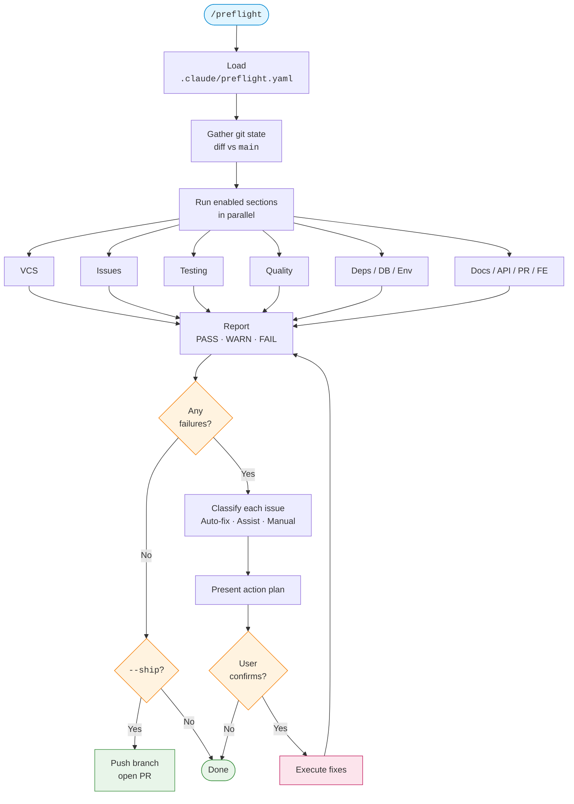

# /preflight

[](https://github.com/mathifonseca/claude-preflight/actions/workflows/ci.yml)
[](LICENSE)
[](https://claude.com/claude-code)
[](CONTRIBUTING.md)

Pre-ship checklist skill for [Claude Code](https://claude.com/claude-code). Validates your branch against a configurable set of checks before you open a PR — and offers to auto-fix what it can.

## How it works



## What it checks

Driven by a per-project `.claude/preflight.yaml`. Enable only the sections you want:

- **VCS** — branch naming, protected branches, clean working tree
- **Issues** — existing ticket linked (Linear/Jira via MCP); never creates new tickets unless asked
- **Testing** — test command passes, coverage threshold, coverage non-decrease vs `main`, new tests for new code
- **Quality** — lint, typecheck, forbidden patterns (e.g. `console.log`, `debugger`), secret detection
- **Dependencies** — lockfile sync, license allowlist
- **Database** — migrations for model changes, reversible migrations
- **Environment** — new env vars documented in `.env.example`, no hardcoded values
- **Documentation** — docs updated when triggered files change
- **API collection** — Postman/OpenAPI updated when API source changes
- **PR hygiene** — diff size, focused changes
- **Frontend** — bundle size, accessibility (`alt`, keyboard nav)

Each check returns `PASS`, `FAIL`, `WARN`, or `SKIP`. Failures block shipping; warnings are surfaced for review.

## What's different about this one

Preflight is **proactive, not passive** — when checks fail, it doesn't just report. It classifies every issue as **auto-fixable** (done for you), **assistable** (drafted for your review), or **manual** (only you can fix). You confirm, it executes, then re-checks.

It also has a `--ship` flag that pushes the branch and opens a PR after all checks pass. If your project uses [GSD](https://github.com/mathifonseca) planning artifacts, the PR body is auto-generated from `ROADMAP.md`, `SUMMARY.md`, and `VERIFICATION.md`.

## Install

```bash
git clone https://github.com/mathifonseca/claude-preflight.git ~/.claude/skills/preflight
```

Claude Code auto-discovers skills in `~/.claude/skills/`.

## Setup

Create `.claude/preflight.yaml` in your project root. Generate a starter:

```
/preflight --init
```

Minimal example:

```yaml
testing:
  command: "npm test"
  coverage:
    min_threshold: 80
    enforce_non_decrease: true
  require_new_tests: true

quality:
  lint_command: "npm run lint"
  no_secrets: true

vcs:
  protected_branches:
    - main
```

See [`references/schema.yaml`](references/schema.yaml) for every option.

## Usage

```
/preflight                          # run all enabled sections
/preflight --section=testing,quality # run specific sections
/preflight --fix                    # auto-apply safe fixes
/preflight --ship                   # after passing, push + open PR
/preflight --init                   # generate starter config
```

## Update

```bash
cd ~/.claude/skills/preflight && git pull
```

## Uninstall

```bash
rm -rf ~/.claude/skills/preflight
```

## Contributing

Contributions welcome. See [CONTRIBUTING.md](CONTRIBUTING.md).

## License

MIT — see [LICENSE](LICENSE).
